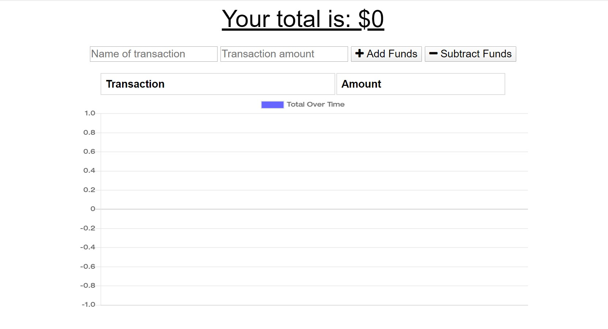

## PWA Budget Tracker
Budget tracker with off-line tracking capability

        

## Description
This application adds off-line capability using manifests and service workers.
        
# Table of contents
1. [Installation](#installation)
2. [Usage](#usage)
3. [License](#license)
4. [Contributing](#contributing)
5. [Tests](#tests)
6. [Questions](#questions)

## Installation <a name="installation"></a>
The following dependencies need to be installed

```
npm i compression, express, lite-server, mongoose, and morgan 
```
Additionally, must run on chrome, with file structure as follows:
root
    public
        icons
            icon-192x192.png
            icon-51x512.png
        db.js
        index.html
        index.js
        manifest.webmanifest
        service-worker.js
        styles.css
    routes
        api.js
    server.js

## Usage <a name="usage"></a>
For users that want to keep track of their budgets but connected to the internet and off-line, this app can help manage expenses and revenues more easily

## License <a name="license"></a>
None.

## Contributing <a name="contributing"></a>
None
        
## Tests <a name = "tests"></a>

```
none

```

## Questions <a name ="questions"></a>
 

If you have an questions about the repo, open an issue or contact [randrmoel](https://api.github.com/users/randrmoel)
at my email: robert.moel@rvmconsulting1.com
